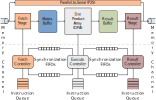

# BISMO




BISMO is a programmable FPGA accelerator for few-bit integer matrix multiplication.
It offers high-performance matrix multiplication for matrices where each
element is a few-bit integer (e.g. 2, 3, 4 ... bits).
This is beneficial for applications like
[quantized neural network inference](https://arxiv.org/abs/1709.04060)
and
[approximate computing](https://en.wikipedia.org/wiki/Approximate_computing)
approaches.
It was developed as part of a collaboration between
[Xilinx Research Labs Ireland](http://www.pynq.io/ml) and the [NTNU Computer Architecture Lab](https://www.ntnu.edu/idi/lab/cal).


Some of its key features are:
* **High performance and energy efficiency.** On the
  [Avnet Ultra96 board](http://zedboard.org/product/ultra96), BISMO can
  offer 15.4 TOPS of binary matrix multiplication performance while drawing less
  than 8 W of power.
* **Configurable size.** The hardware can be [scaled](doc/hardware.md) up for higher performance, or
  down to save on FPGA resources and power consumption.
* **Runtime scales with precision.** The input matrices can have any number of
  bits specified at runtime. Higher bit-precision will take more time.
* **Software-programmable.** BISMO comes with a [runtime library](doc/software.md) for ease-of-use, and is also programmable with a simple instruction set to
  cater for more advanced users.

## What's New in BISMO?

* **2019-06-10:** BISMO v2 is now released with many improvements and new features. Here's a brief summary:
  - Runtime library
  - Instruction generators with tiling support for large matrices
  - Improved hardware with smaller resource cost
  - Hardware-accelerated parallel-to-serial conversion
  - Support for PYNQ on the Avnet Ultra96 (PYNQU96)
  - Experimental support for cache coherency on (PYNQU96CC)

## Requirements

### Full Setup on Linux
1. A working [`sbt`](https://www.scala-sbt.org/1.0/docs/Installing-sbt-on-Linux.html) setup for Chisel2
2. `zsh` e.g. `sudo apt install zsh` on Ubuntu
3. [Vivado 2017.4](https://www.xilinx.com/support/download.html) or later (make sure `vivado` is in `PATH`)
4. `gcc` 4.8 or later
5. `verilator` e.g. `sudo apt install verilator` on Ubuntu
6. A supported [PYNQ board](doc/platforms) board with the v2.4 image or later, with network access

## Quickstart

Start by cloning BISMO with the `--recurse-submodules` flag:

`git clone --recurse-submodules https://github.com/EECS-NTNU/bismo.git`

You can "run" BISMO with this code either in hardware-software cosimulation
on a host PC, or on the actual FPGA platform as follows:

### Running HW-SW Cosimulation
1. `cd bismo`
2. `PLATFORM=VerilatedTester make emu` to run BISMO tests in hardware-software cosimulation.

### Running on the FPGA
BISMO is built on a *host computer* and deployed on a *target board*. Several [PYNQ boards](doc/platforms.md) are supported, the example below is for the Avnet Ultra96.

On the host computer:
1. `cd bismo`
2. `make all` to generate a Ultra96 deployment package with bitfile and drivers.
This will generate a 2x64x2 array at 200 MHz and will take some time to complete.
3. Set `PYNQU96_URI` to point to the `rsync` target, including the username, IP
address and target directory on the Ultra96 board.
For instance `export PYNQU96_URI=xilinx@192.168.2.10:/home/xilinx/bismo`
4. `make rsync` to copy deployment package to the Ultra96. You may be prompted
for the password for the specified Ultra96 user.

Afterwards, run the following on a terminal on the target board:
1. On the Ultra96, `cd /home/xilinx/bismo/deploy` to go into the deployment package.
2. `su` to go into superuser mode.
2. `./compile_rtlib.sh` to compile the driver and runtime library.
3. `./compile_testapp.sh` to compile the test application.
3. `./setclk.sh 200` to set the clock to 200 MHz.
4. `./load_bitfile.sh` to load the BISMO bitfile.
5. `LD_LIBRARY_PATH=$(pwd) ./testapp t` to run the BISMO tests.

## Documentation
You will find more detailed documentation under the [`doc`](doc/README.md) folder.

## Paper
More details on the hardware design and instruction set can be found in the
extended [BISMO paper](https://arxiv.org/pdf/1901.00370.pdf) or the
[presentation](https://docs.google.com/presentation/d/1cMCzzgi8VESY2O9AJpcU78XG0YmY4yuFbQngI3-Fm10/edit?usp=sharing)
from FPL'18. If you find BISMO useful, please use the following citation(s):

```
article{bismo_trets,
 author = {Umuroglu, Yaman and Conficconi, Davide and Rasnayake, Lahiru and Preusser, Thomas and Sjalander, Magnus},
 title = {Optimizing Bit-Serial Matrix Multiplication for
 Reconfigurable Computing},
 journal = {ACM Transactions on Reconfigurable Technology and Systems},
 year = {2019},
 publisher = {ACM}
}

@inproceedings{bismo,
author = {Umuroglu, Yaman and Rasnayake, Lahiru and Sjalander, Magnus},
title = {BISMO: A Scalable Bit-Serial Matrix Multiplication Overlay for Reconfigurable Computing},
booktitle = {Field Programmable Logic and Applications (FPL), 2018 28th International Conference on},
series = {FPL '18},
year = {2018}
}
```
